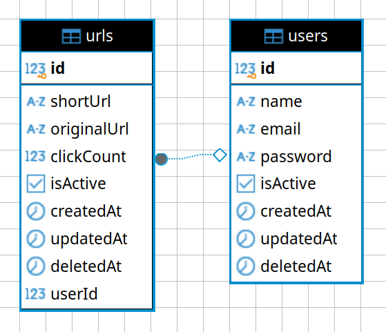

# Teste Técnico Teddy Open Finance

Esse repositório contém o teste técnico Teddy Open Finance realizado com Typescript/Node/Express/PostgreSQL.

## Atenção ao rodar
O projeto usa por padrão para API a porta 5050 e para o Banco de Dados 5432. Caso estas portas estejam em uso se faz necessário modificar elas no docker-compose.yml do projeto. 

## Tabela de Conteúdo

- [Entidades](#entidades)
- [Instalação](#instalação)
- [Uso](#uso)
- [Necessita](#necessita)

## Entidades
Para contrução desse projeto foi criada as entidades:
- Users
- Urls

<div align="center">
    
</div>

### Users
- `id`: Identificador único do usuário.
- `username`: Nome de usuário.
- `password`: Senha do usuário.
- `email`: Email do usuário.
- `createdAt`: Data de criação do usuário.
- `updatedAt`: Data de atualização do usuário.

### Urls
- `id`: Identificador único da URL.
- `originalUrl`: URL original.
- `shortUrl`: URL encurtada.
- `userId`: Identificador do usuário que criou a URL.
- `createdAt`: Data de criação da URL.
- `updatedAt`: Data de atualização da URL.

## Instalação

Intruções para rodar o projeto. Para rodar o projeto se faz necessário ter o docker composer instalado.

```bash
# Clone o repositório
git clone https://github.com/Arturstriker3/test-teddy

# Navegue até o diretório do projeto
cd test-teddy

# Execução 1: Com o composer instalado execute o comando para rodar o banco de dados e backend juntos dockerizados
docker-compose up -d
```

## Uso

Para experimentar o projeto rodando pode ser usado a documenação do swagger e rotas de apoio (Por padrão estará na porta 5050) :

```bash
# Rota de Sáude
http://localhost:5050/status

# Documentação
http://localhost:5050/docs

# Métricas Prometheus
http://localhost:5050/metrics
```

## Necessita

Pendências para serem implementadas depois:

- Adicionar mais instrumentação de observabilidade (ELK, Logstash, Kibana ...)
- Deploy no ambiente em um cloud provider e expor no readme o link.
- Monorepo com separação de serviços como gerenciamento de identidade e acesso e regra de negócio de encurtar URL com comunicação entre os serviços com docker-compose.
- Git para clonar o repositório
- Construir deployments do Kubernetes para deploy.
- Construir artefatos do Terraform para deploy.
- Integrar github actions para lint e testes automatizados (Husky ...).

